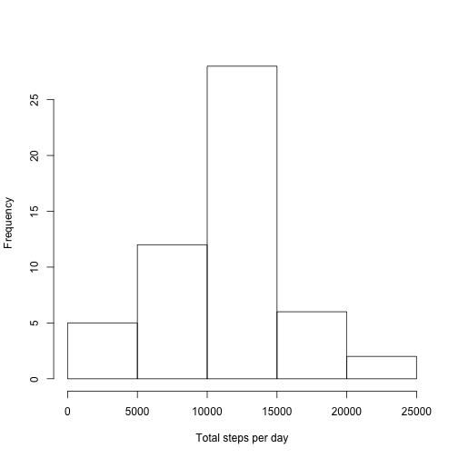
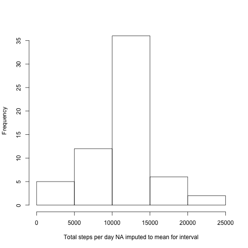
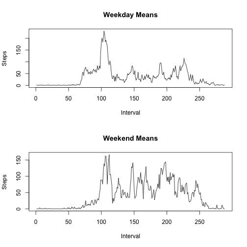

## Loading and preprocessing the data

```r
a=read.csv("activity.csv")
b=na.omit(a)
```
## What is mean total number of steps taken per day?
### Make a histogram of the total number of steps taken each day

```r
steps=aggregate(b$steps,by=(list(b$date)),FUN=sum)
colnames(steps)=c("Date","Steps")
hist(steps$Steps,main="",xlab="Total steps per day")
```

 

### Calculate and report the mean and median total number of steps taken per day

```r
mean(steps$Steps)
```

```
## [1] 10766.19
```

```r
median(steps$Steps)
```

```
## [1] 10765
```
## What is the average daily activity pattern?

```r
interval=aggregate(b$steps,by=(list(b$interval)),FUN=mean)
 plot(interval,type="l",xlab="Time (24 hour clock)",ylab="Mean number steps")
```

 

### Which 5-minute interval, on average across all the days in the dataset, contains the maximum number of steps?

```r
interval[which.max(interval$x),]
```

```
##     Group.1        x
## 104     835 206.1698
```

## Imputing missing values
### Calculate and report the total number of missing values in the dataset 

```r
sum(is.na(a))
```

```
## [1] 2304
```

### Devise a strategy for filling in all of the missing values in the dataset. The strategy does not need to be sophisticated. You could use the mean for that 5-minute interval.


```r
anew=a
for (i in 1:nrow(anew)) {
     if (is.na(anew$steps[i])) {
         anew$steps[i]=interval[match(anew$interval[i],interval[,1]),2]         
     }
}
```
### Make a histogram of the total number of steps taken each day and Calculate and report the mean and median total number of steps taken per day.


```r
steps=aggregate(anew$steps,by=(list(anew$date)),FUN=sum)
colnames(steps)=c("Date","Steps")
hist(steps$Steps,main="",xlab="Total steps per day NA imputed to mean for interval")
```

 

```r
mean(steps$Steps)
```

```
## [1] 10766.19
```

```r
median(steps$Steps)
```

```
## [1] 10766.19
```

## Are there differences in activity patterns between weekdays and weekends? Yes


```r
anew[,4]=as.character(length(anew))
colnames(anew)[4]="day"
for (i in 1:nrow(anew)){
     if (weekdays(as.Date(as.character(anew$date[i])))=="Saturday" | weekdays(as.Date(as.character(anew$date[i]))) =="Sunday"){ anew$day[i] = "Weekend"}
          else{anew$day[i]="Weekday"}
   
}

weekday=anew[anew$day=="Weekday",]
weekend=anew[anew$day=="Weekend",]
dmeans=tapply(weekday$steps,weekday$interval,mean)
emeans=tapply(weekend$steps,weekend$interval,mean)
par (mfrow=c(2,1))
plot(dmeans,type="l",main="Weekday Means",xlab="Interval",ylab="Steps")
plot(emeans,type="l",main="Weekend Means",xlab="Interval",ylab="Steps")
```

 
